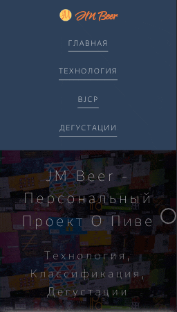
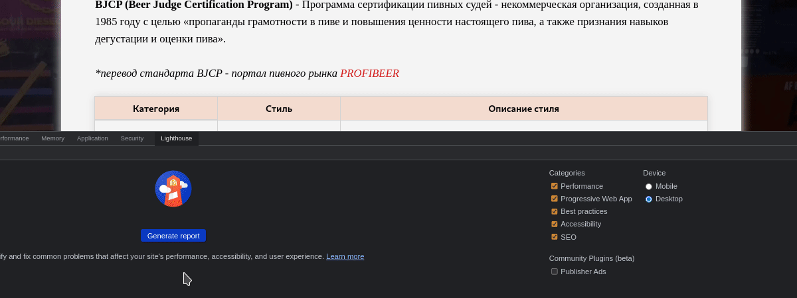

# JM Beer Project

Персональный блог о пиве, в котором я рассказываю об основных технологических этапах производства пива, а также провожу дегустации разных сортов с их последующей
оценкой по вкусовым, ароматическим и другим показателям. 

Содержание
==========

* [Стэк технологий](#стэк-технологий)
* [Структура сайта](#структура-сайта)
* [Мобильная вёрстка](#мобильная-вёрстка)
* [Lighthouse метрики](#lighthouse-метрики)
* [Поддержка PWA](#поддержка-pwa)

### Стэк технологий
-------------------
Перечень используемых технологий и библиотек при создании сайта:
+ [`Препроцессор SASS/SCSS`](https://github.com/sass/sass) - метаязык на основе CSS, предназначенный для увеличения уровня абстракции CSS-кода и упрощения файлов каскадных таблиц стилей;
+ [`Create React App`](https://github.com/facebook/create-react-app) - набор инструментов, созданный и поддерживаемый разработчиками из Facebook, и предназначенный для быстрого создания шаблонных проектов React-приложений;
+ [`simple-react-lightbox`](https://github.com/michelecocuccio/simple-react-lightbox) - библиотека для создания галереи изображений для React-приложений;
+ [`aos`](https://github.com/michalsnik/aos) - библиотека анимаций при скролле;
+ [`Firebase Cloud Firestore`](https://firebase.google.com/docs/firestore/) - гибкая, масштабируемая облачная база данных от Firebase и Google Cloud Platform для веба, мобильных платформ, и серверных приложений;
+ [`Firebase Hosting`](https://firebase.google.com/docs/hosting/) - используемый хостинг.

### Структура сайта
-------------------

#### Главная 
Стартовая страница сайта, на который представлена карта классификации сортов пива, а также перечень последних пяти дегустаций с кратким обзором основных характеристик пива. 

#### Технология
Раздел, посвящённый основным этапам производства пива. Дан краткий обзор ингредиентов, их влияние на вкус и аромат конечного продукта. В конце раздела указаны используемые ресурсы.

#### BJCP 
Таблица классификации пива в соответствии со стандартом BJCP. Описание каждого стиля содержится в базе данных Firebase Cloud Firestore. При клике на интересующий стиль идёт обращение к базе данных, загрузка соответствующего стиля и его отображение в таблице.

#### Дегустации
Раздел представлен в виде карточек на каждое продегустированное пиво. Карточка состоит из основных характеристик пива, а также описания вкусовых, ароматических и других свойств соответствующего экземпляра.

### Мобильная вёрстка
---------------------
Вёрстка сайта оптимизирована под большинство мобильных устройств и планшетов. Пример вёрстки для iPhone 6/7/8:

### Lighthouse метрики
----------------------
Для всех разделов сайта оптимизированы метрики Lighthouse и составляют в среднем от 92 до 100 баллов. Ниже представлена оценка Lighthouse для раздела BJCP.

### Поддержка PWA
-----------------
Сайт поддерживает технологию Progressive Web App, позволяющую визуально и функционально трансформировать сайт в приложение (мобильное приложение в браузере).
Для того чтобы установить приложение: 
1. На десктопе - необходимо в конце адресной строки нажать на значок "Установить приложение JM Beer"
2. На мобильном устройстве - нажать на "Добавить приложение на главный экран" при появлении соответствующей опции
